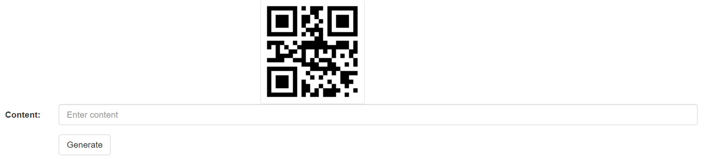

# qr-code-generator

> A QR Code Generator

## Table of contents

- [General info](#general-info)
- [Screenshots](#screenshots)
- [Technologies](#technologies)
- [Setup](#setup)
- [Live Application](#live-application)
- [Features](#features)
- [Status](#status)
- [Inspiration](#inspiration)
- [Contact](#contact)

## General info

A QR Code Generator because I didn't want to use the "free" ones found online.

## Screenshots

## Technologies

- HTML
- CSS
- jQuery
- Bootstrap

## Setup

Open the link to the live application in any modern browser.

## Live Application

[Live Application](https://sbillsborough.github.io/qr-code-generator/)

## Features

List of features ready and TODOs for future development

- Generates a QR code for any text/links.

To-do list:

- Improve styling
- Add sharing to device/apps functionality

## Status

Project is: _in progress_

## Inspiration

Credit: [Geeks for Geeks - Source Code](https://www.geeksforgeeks.org/qr-code-generator-using-html-css-and-jquery/#amp_tf=From%20%251%24s&aoh=16996689006449&referrer=https%3A%2F%2Fwww.google.com&ampshare=https%3A%2F%2Fwww.geeksforgeeks.org%2Fqr-code-generator-using-html-css-and-jquery%2F)

## Contact

Created by [@sbillsborough](https://github.com/sbillsborough) - feel free to contact me!
